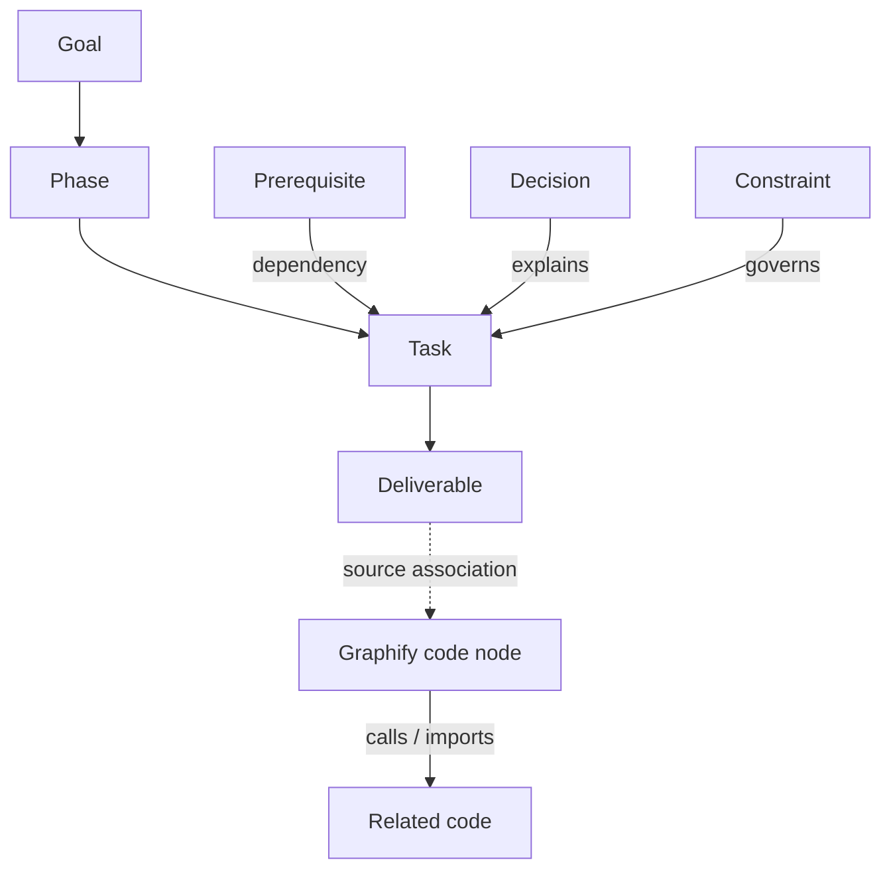
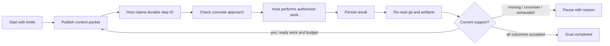

# Goal mode: visual roadmap and agent execution

Implemented in this checkout on 2026-09-09. This replaces the earlier prototype-only status. The packaged commands are `roadmap workspace`, `roadmap context`, `roadmap impact`, `roadmap onboard`, and `roadmap goal`.

The original design preview under `reviews/` remains a historical artifact. Use the production workspace below for current behavior.

## Open the workspace

From this checkout:

```sh
python3 -m roadmapify workspace --serve
```

Open the printed loopback URL. It includes a per-process token for live run controls. For a portable offline snapshot:

```sh
python3 -m roadmapify workspace --out roadmap-out/goal.html
```

The workspace uses packaged HTML, CSS and JavaScript, system fonts, accessible button nodes and SVG connectors. It adds no runtime dependency.

| View | Implemented behavior |
| --- | --- |
| Goal map | Goal, success criteria, ordered phases and milestone inspectors |
| Dependencies | Task DAG, phase scope, prerequisite/dependent focus and task details |
| Decisions | Effective decisions and constraints connected to the focused task |
| Graphify bridge | Local JSON import, exact source associations, original code relations and confidence |
| Execution | Persisted run state, limits, active task, start/pause/resume/cancel controls |

Search, pan/zoom, SVG preview/source/download, and a text outline support navigation and sharing. On narrow screens the inspector moves below the diagram. Offline snapshots provide diagrams and context inspection; live controls require the local server.



Phase order is not a task dependency. Code associations are context, not completion evidence. Task statuses remain derived; dragging or selecting a node never sets status.

## Execution that can be connected to an agent

The controller and local host protocol are implemented. **No commercial agent provider or executable is automatically connected.** An existing agent host claims queued work through the CLI, or its embedding application supplies the Python host object to `execution.drive()`.



The implementation includes:

- Explicit scope, step limits and deadlines.
- Atomic, locked operational state under the gitignored output directory.
- Durable run/step IDs, exclusive worker ownership and idempotent result receipt.
- Context and approach checks before work; changed plan or effective memory pauses advancement.
- Saved result receipt before reconciliation, so crash recovery does not blindly rerun work.
- Host-acknowledged pause/cancellation. Deadlines request a stop; the external host must enforce it.
- Unknown token/cost usage represented as `null`.
- Host-reported checks kept separate from artifact inspection and current git evidence.
- Explicit human acceptance for every goal criterion. Changed artifact content invalidates acceptance.

A success report cannot set a task to done. If work is prepared but lacks current git or artifact support, the run pauses for inspection and integration. Roadmapify never commits or modifies git refs to manufacture evidence.

See [the complete host protocol and API](roadmapify/references/goal-host.md), including example commands, result format, crash recovery and human acceptance.

## Graphify compatibility

The production bridge accepts both graphify exchange forms: `nodes` plus `links`, or `nodes` plus `edges`. Imports are bounded to 10 MB, 10,000 nodes and 50,000 edges. IDs and edge endpoints are validated.

```sh
python3 -m roadmapify workspace --code-graph /path/to/graph.json
python3 -m roadmapify context T-01 --code-graph /path/to/graph.json --source-root /original/checkout
python3 -m roadmapify verify --code-graph /path/to/graph.json
```

Associations use exact normalized source paths or unambiguous qualified identity. A different checkout needs an explicit source root; the bridge never guesses from a basename. Original relation direction, confidence and source locations are preserved. The two source graphs are not overwritten with a combined graph.

`symbol:` verification requires a unique exact ID or `qualified_name`. Indexed presence is weak context with unknown freshness; it cannot establish implementation completeness. See [verification semantics](roadmapify/references/verify.md).

## Supporting workflow improvements

- `context`: task-focused recovery with effective memory, blockers, admitted/stale git observations, artifact inspection, reported checks and next action.
- `impact`: affected task/decision nodes from the current plan graph.
- `onboard`: inspect historical commit proposals, then explicitly accept exact associations with a reason.
- `check --json`: shared structured policy results across CLI and MCP.
- `init --example-input ... --example-output ... --criteria ...`: representative examples and explicit outcome criteria; templates provide input/output/acceptance guidance and proposed deliverables.
- `doctor`: identify missing examples, criteria, deliverables and unreviewed template assumptions.

The implementation anchors are T-29 through T-34 in the existing roadmap. Existing provisional features such as moderation and optional LLM refinement retain their own status; this change does not claim that every historical roadmap phase is complete.

## Validation

The original 18 defect reproductions are now desired-behavior regression tests in `tests/test_review_regressions.py`. Additional integration tests cover host file changes, limits, approach checks, crash recovery, duplicate claims/results, acknowledged cancellation, goal acceptance invalidation, graphify mappings, reviewed onboarding and local API authorization.

Browser checks exercise the actual local workspace controls and diagrams. The wheel includes the workspace asset and host documentation. Provider-specific certification remains the responsibility of the connected host; the fixture host test does not claim a real commercial provider was connected.
