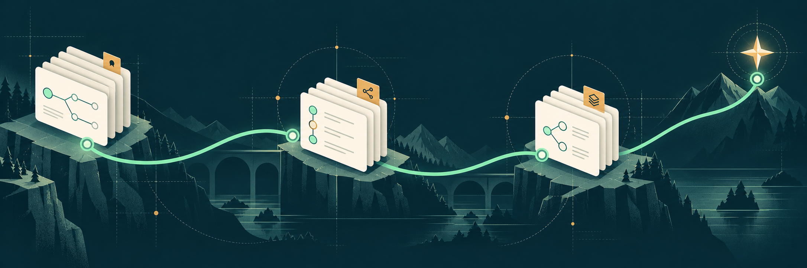
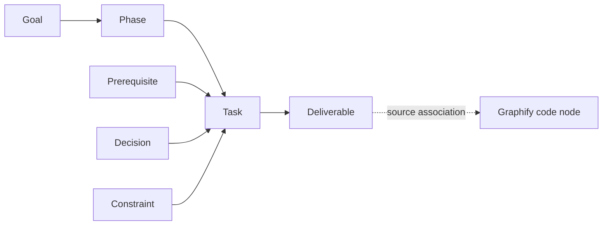

<p align="center">
  <picture>
    <source media="(prefers-color-scheme: dark)" srcset="docs/brand/logo-dark.png">
    
  </picture>
</p>

<h1 align="center">roadmapify</h1>

<p align="center"><strong>A phased build plan with memory that survives context loss.</strong></p>
<p align="center">Visualize the goal. Remember the decisions. Move work forward with evidence.</p>

<p align="center">
  <a href="#quick-start">Quick start</a> ·
  <a href="#visual-goal-workspace">Visual workspace</a> ·
  <a href="#bounded-agent-execution">Goal execution</a> ·
  <a href="#daily-workflow">Workflow</a> ·
  <a href="#command-reference">Commands</a> ·
  <a href="#use-with-an-agent">Agent setup</a> ·
  <a href="ARCHITECTURE.md">Architecture</a>
</p>

<p align="center">Python 3.10+ &nbsp; · &nbsp; Offline core &nbsp; · &nbsp; No API key &nbsp; · &nbsp; Apache-2.0</p>



Every new session should start with the project, not a reconstruction of the chat.
**roadmapify** keeps your goal, phase dependencies, and decision history in your
repository, with a visual workspace for exploring the plan and coordinating
bounded agent work. It helps you and your coding agent answer four questions:
**What are we building? Why? In what order? Where are we now?**

- **See the whole plan:** explore goal, phase, task and decision nodes with dependency diagrams.
- **Recover context:** rebuild `BRIEF.md` or request a focused task packet with blockers and the next action.
- **Remember why:** record decisions and rejected alternatives, then check new proposals against them.
- **Find the next task:** inspect dependencies, ready work, and the critical path.
- **Check the evidence:** derive progress from observed git facts and inspect declared deliverables.
- **Connect code and execution:** import Graphify context and queue bounded work for an existing agent host.

The core runs locally with no API key. On Python 3.11+, the base package has no
runtime dependencies; Python 3.10 adds only `tomli`.

## Quick start

### 1. Install from this repository

You need **Python 3.10+**. Git is required for `sync` and git hooks.
From a local checkout of this repository:

```bash
uv tool install .
roadmap --version
```

Alternatively, install into a virtual environment:

```bash
python -m venv .venv
source .venv/bin/activate
python -m pip install .
roadmap --help
```

On Windows PowerShell, activate with `.venv\Scripts\Activate.ps1` instead.
The CLI is called `roadmap`; `rmap` is a short alias. You can also use
`python -m roadmapify` in an environment where the package is installed.
When developing in this checkout, `python3 -m roadmapify` uses the current source;
an older globally installed `roadmap` executable may use a different version.

### 2. Give your project a goal

Run this in the project you want to plan, or try it in a new directory:

```bash
mkdir roadmap-demo
cd roadmap-demo

roadmap init "a CLI that syncs Notion pages to markdown" \
  --why "I keep losing notes between Notion and my repo" \
  --archetype cli \
  --example-input "A Notion page with a heading and a checklist" \
  --example-output "A Markdown file preserving the heading and checklist" \
  --criteria "A second sync with unchanged input leaves the Markdown unchanged"

roadmap next
roadmap tree --deps
```

`init` writes a full phase skeleton from a local template. The input/output flags
are a pair; repeat `--criteria` for additional success criteria. Edit
`roadmap.toml` to review the proposed artifacts, assumptions and dependencies.
`roadmap doctor` reports missing planning details and unreviewed templates. Later
phases start as **provisional**: visible in the plan, but excluded from ready
lists and normal health calculations until you promote them.

It also creates the journal and derived brief/graph, and adds marked sections to
`.gitignore` and `.gitattributes` for roadmap files.

### 3. Record a decision—and see it remembered

```bash
roadmap note "sync is one-way, Notion to markdown, never back" \
  --rejected "bidirectional sync: conflict resolution across two schemas is its own product"

roadmap check "add bidirectional sync so edits flow back to Notion"
```

The check reports **REJECTED** and exits **3**, with the recorded reason.
That nonzero exit is the expected result of this example.

```bash
roadmap why "bidirectional sync"
roadmap brief --print
```

The next session gets the same decision without needing the original conversation.

## Visual goal workspace

Open a local workspace for the project you initialized:

```bash
roadmap workspace --serve
```

Open the printed `127.0.0.1` URL, including its token fragment. The server runs
until you stop it with Ctrl+C. Use `--port 8772` to choose a port.

| View | What you can explore |
| --- | --- |
| Goal map | The goal, success criteria, ordered phases and suggested next task |
| Dependencies | Task nodes, prerequisites, blockers, phase/status filters and the remaining path |
| Decisions | Applicable decisions and constraints attached to a task |
| Code links | Graphify source associations and code relationships |

Search, pan/zoom, a text outline and node inspectors help you navigate. Export
the visible diagram as SVG, or generate a portable workspace snapshot:

```bash
roadmap workspace --out roadmap-out/goal.html
```

The snapshot opens offline with no external scripts, fonts or API keys. Live
execution controls require the local server. Neither view lets a node click
set task completion; status stays derived from evidence.



### Add Graphify context

Import a Graphify JSON file through the **Code links** view, or preload it:

```bash
roadmap workspace --serve --code-graph /path/to/graph.json
roadmap context T-01 --code-graph /path/to/graph.json
```

The bridge accepts `nodes` with either `links` or `edges`. It matches exact source
paths and qualified identities, preserving relation direction and confidence.
For a graph produced in another checkout, set **Source root** in the workspace,
or use `context --source-root /original/checkout`. Code relationships add context;
they do not establish completion. See [Goal mode](GOAL_MODE.md) for import limits
and verification details.

## Bounded agent execution

Goal mode includes a durable controller and local host API. **An existing agent
host must connect to perform work; Roadmapify does not automatically launch an
agent or select a provider.** Without a connected host, a started run waits in
the queue.

Start through the workspace, or use the CLI for the same controls:

```bash
roadmap goal start --steps 3 --minutes 20
roadmap goal status
roadmap goal pause
roadmap goal resume --steps 5 --minutes 30
roadmap goal cancel
```

The host claims a task packet, checks its proposed approach, performs the work
in its own execution environment, and reports observations. The controller
reconciles current git and artifact evidence before advancing. Uncommitted work
normally pauses for human integration. Each goal criterion also requires
explicit human acceptance with current supporting evidence.

Pause and cancellation requests need acknowledgment once a host owns a step.
Step and time limits bound the run; the host enforces stopping its work. Durable
step IDs and saved results support crash recovery without blindly repeating work.
The local queue works offline; a connected host's network and credential needs
depend on that host.

See the [host protocol](roadmapify/references/goal-host.md) for `claim`, `check`,
`finish`, result formats, recovery and the Python `execution.drive()` API.

## Daily workflow

| When | Run | What you get |
| --- | --- | --- |
| Starting a session | `roadmap build` then `roadmap next` | Rebuilt context and ready tasks |
| Focusing on a task | `roadmap context T-01` | Goal, applicable memory, blockers, evidence and a next action |
| Considering an approach | `roadmap check "<approach>"` | Related decisions, rejections, or constraint violations |
| Making a decision | `roadmap note "<decision>" --why "<reason>"` | Durable memory with a short record ID |
| Understanding a dependency | `roadmap path P-1 T-01` | A path through the plan graph |
| Finding context in memory | `roadmap query "<question>"` | Relevant plan and decision nodes |
| Inspecting a node | `roadmap explain <id>` | The node's connections and recorded context |
| Reviewing a requirement change | `roadmap impact T-01` | Downstream tasks and attached decisions |
| Reviewing recorded progress | `roadmap sync --dry-run` then `roadmap sync` | A preview, then appended git evidence |
| Inspecting deliverables | `roadmap verify` | Presence findings against the plan |
| Reviewing the next phase | `roadmap expand P-3 --dry-run` | A preview of promoting provisional tasks |
| Sharing the plan | `roadmap workspace` or `roadmap export html --out roadmap-out/roadmap.html` | An offline visual workspace or a document-style roadmap |
| Ending a session | `roadmap checkpoint "<handoff notes>" --session <ID>` | Close the selected session with recovery notes |

Use phase and task IDs from your own `roadmap tree`. After reviewing an expansion,
run `roadmap expand P-3` to apply it. If a rewrite would lose hand edits, the
command refuses and explains why; review that output before considering `--force`.
Use `roadmap resume --list` to inspect interrupted sessions and `roadmap resume ID`
to continue one. An explicit checkpoint session prevents closing unrelated work.

### Connect work to git evidence

In a git repository, include a task ID in a commit message trailer:

```text
Implement the command dispatcher

Roadmap: T-02
```

Then run `roadmap sync` and `roadmap next`. Sync reads commits and refs and appends
observations to `evidence.jsonl`; task state is derived from that evidence.
Sync never creates branches, commits, merges, or pushes. A trailer alone is not
a guarantee that a task is complete: provenance and merge evidence affect status.
Evidence is reconciled against current git support and the task's definition.
Missing history or changed deliverables can make an old observation stale or
unknown. Foreign observations require review before they can carry local authority.

For an existing repository without task trailers, review historical associations:

```bash
roadmap onboard
roadmap onboard --accept FULL_COMMIT_SHA --task T-01 --why "Reviewed this commit against the task deliverables"
```

Replace the SHA and task ID with a reviewed proposal. Acceptance records the
association and its provenance without rewriting the commit.

### Understand verification

`roadmap verify` inspects declared deliverables without executing them. It is a
presence check, not a test runner or proof that behavior is correct.

| Verdict | Meaning |
| --- | --- |
| `present` | The declared artifact or symbol was found |
| `missing` | A resolvable artifact was not found |
| `unverifiable` | The declaration cannot be checked automatically, such as a command to run |
| `unresolvable` | The plan has a declaration problem that needs correction |

Exit **5** means a task claiming completion has a missing deliverable. Exit **0**
does not mean every artifact exists or every test passes. Run your project's tests
separately, and use `roadmap verify --json` when you need the full report.
Task context keeps git observations, artifact presence, host-reported checks and
uncertainty separate. Unknown or partial support cannot corroborate an entire
completion claim. `roadmap check --json` and MCP also share one checking engine,
with accepted and retired memory handled consistently across views.

## Use with an agent

Install standing instructions in the project:

```bash
roadmap install
```

This updates marked blocks in existing `CLAUDE.md` and `AGENTS.md` files. If neither
exists, it creates `CLAUDE.md`. The block tells an agent to recover the brief,
check approaches, record decisions, and verify deliverables.

To also install the bundled skill, choose the platform you use:

```bash
roadmap install --platform claude --project
roadmap install --platform agents --project
roadmap install --platform cursor
```

`claude` and `agents` use project-local skill directories with `--project`;
without it they install in your home directory. `cursor` writes a project rule.
See the [bundled skill](roadmapify/skill.md) for the complete workflow.

In a git repository, optional hooks keep the brief and graph current after commits
and checkouts:

```bash
roadmap hook install
roadmap hook status
# Remove them later with: roadmap hook uninstall
```

See [hook behavior and opt-out](roadmapify/references/hooks.md).

### Optional MCP server

From this checkout, install the MCP extra:

```bash
uv tool install --force '.[mcp]'
roadmap-mcp --root /absolute/path/to/your/project
```

For a client that accepts a `mcpServers` configuration, use:

```json
{
  "mcpServers": {
    "roadmapify": {
      "command": "roadmap-mcp",
      "args": ["--root", "/absolute/path/to/your/project"]
    }
  }
}
```

Replace the project path. The server speaks **stdio** and exposes six read tools
for brief, graph, and approach queries, plus `record_note` for writing memory.
`roadmap-mcp --list-tools` prints the tool schemas without starting a server.

## How the files fit together

Three plain-text files are durable project state:

| File | Role | How to maintain it |
| --- | --- | --- |
| `roadmap.toml` | Goal, phases, tasks, dependencies, deliverables | Edit and commit it |
| `roadmap-out/journal.jsonl` | Decisions, rejections, constraints, sessions | Append through the CLI; commit it |
| `roadmap-out/evidence.jsonl` | Observed git facts | Generated by sync; commit it when present |

Generated views and local execution state have a different lifecycle:

| File | Git policy | Recovery |
| --- | --- | --- |
| `roadmap-out/BRIEF.md`, `roadmap-out/graph.json` | Ignored | Rebuild with `roadmap build` |
| `roadmap-out/goal.html` and other exports under `roadmap-out/` | Ignored | Regenerate with `workspace` or `export html` |
| `roadmap-out/.goal-run.json` | Ignored; local operational state | Resume or reconcile through `roadmap goal`; retain it while a host owns a step |
| `roadmap-out/.roadmap.lock` | Ignored; runtime coordination | Managed by the commands |

On a fresh clone, run `roadmap build` to regenerate the brief and graph. Edit the
durable plan or use the CLI instead of editing generated output. The ignore
rules preserve both append-only logs; they also leave source HTML, Graphify
fixtures and documentation artwork trackable. Keep exports under `roadmap-out/`
to avoid accidentally committing snapshots containing local paths and context.

There is **no task status field** to maintain in `roadmap.toml`. The append-only
logs use content-hashed IDs and git's built-in union merge driver. Graph queries
traverse the plan and memory, rather than parsing your source code.

## Command reference

All commands below are implemented in this checkout. Use `roadmap <command> --help`
for flags and `--root /path/to/project` to target another directory.

| Command | Purpose |
| --- | --- |
| `init "<goal>"` | Generate a plan with `auto`, `generic`, or `cli` archetypes |
| `note "<text>"` | Record a decision, constraint, risk, note, or question |
| `check "<approach>"` | Check recorded rejections and constraints |
| `why <id or text>` | Retrieve decisions and their reversals |
| `build` / `brief` | Rebuild the brief and graph; `--print` shows the brief |
| `next` / `tree` | Show ready work or the full dependency plan |
| `expand <P-n>` | Promote a provisional phase after review |
| `sync` | Read git and record evidence; supports `--dry-run` |
| `verify [T-nn]` | Inspect deliverables; supports `--phase` and `--json` |
| `query "<question>"` | Retrieve a scoped subgraph |
| `explain <id or text>` | Inspect a node and its connections |
| `path <a> <b>` | Find a shortest path between graph nodes |
| `resume` / `checkpoint` | Recover interrupted work or close a session |
| `doctor` | Report plan-quality, memory and session issues |
| `install` | Install standing agent instructions and optional skill |
| `hook install/status/uninstall` | Manage brief-refresh hooks |
| `export html` | Render an offline HTML roadmap |
| `workspace [--serve]` | Visual goal, dependency, decision and code diagrams; optional live controls |
| `context [T-ID]` | Current task recovery packet with separate evidence dimensions |
| `impact <node>` | Downstream tasks and attached decisions |
| `onboard` | Review and accept historical commit associations |
| `goal start/status/pause/resume/cancel` | Set limits and control a local goal run |
| `goal claim/check/finish/tick` | Agent host protocol and reconciliation |
| `goal accept` | Record human acceptance of a goal criterion |

| Exit code | Meaning |
| --- | --- |
| `0` | Command succeeded, or an approach was clear |
| `1` | Error; read the diagnostic |
| `2` | Recognized capability is not implemented yet |
| `3` | Approach matches a recorded rejection |
| `4` | Approach violates a recorded constraint |
| `5` | Verification contradicts a completion claim |

### Current scope

This is an early **0.1.0** project. Memory, offline planning, graph traversal,
git sync, deliverable verification, hooks, agent installation, HTML export, and
the optional MCP server are implemented, together with the visual workspace,
task context, impact analysis, reviewed onboarding and local goal execution protocol.

`start`, `done`, `map`, `moderate`, and `expand --llm` are **planned** and currently
return exit 2. Installing the `llm` extra does not enable refinement yet. See
[roadmap.toml](roadmap.toml) for the complete phase plan. The planned top-level
`roadmap start` is distinct from the implemented `roadmap goal start`.

The [implementation status](IMPLEMENTATION_STATUS.md) maps the original 18 review
issues to repairs and regression coverage. [Goal mode](GOAL_MODE.md) describes the
visual workspace and execution contract in detail. These describe implemented
behavior; they do not declare every roadmap phase complete.

## Contributing

From a checkout, install the development environment and run the checks:

```bash
uv sync --group dev
uv run python -m roadmapify build
uv run python -m roadmapify next
uv run pytest
uv run ruff check .
uv run python -m roadmapify verify
```

Read [AGENTS.md](AGENTS.md) and [ARCHITECTURE.md](ARCHITECTURE.md) before changing
the design. Check approaches with `roadmap check` and record decisions with
`roadmap note`. For bugs, include the command, output, Python version, and a
minimal plan that reproduces the issue in a [GitHub issue](https://github.com/ultrainstinct07/Roadmapify/issues).

Logo variants, artwork, and usage notes live in [docs/brand](docs/brand/README.md).

## License

[Apache License 2.0](LICENSE).
